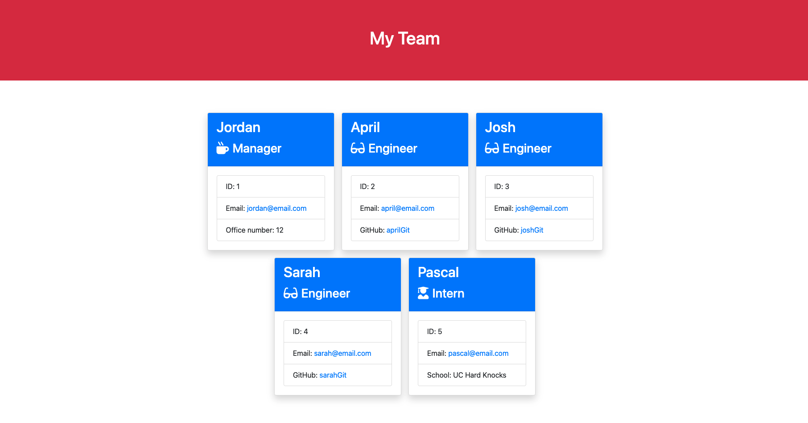
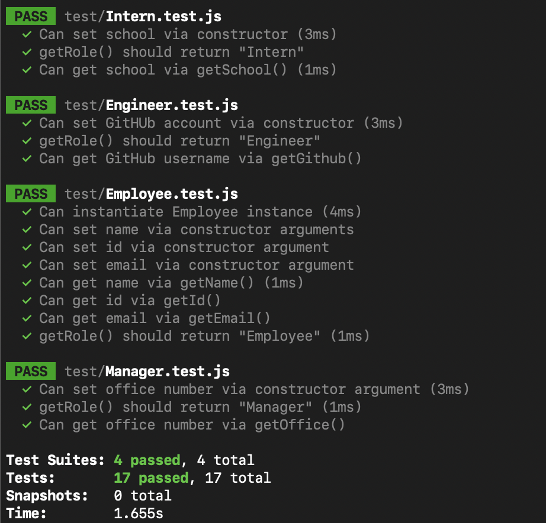

# Employee Summary Template Engine

## Table of Contents
* [Project Summary](##project-summary)
* [Technologies Used](##technologies-used)
* [How to Access](##how-to-access)
* [About Me](##about-me)
* [Screenshots](##screenshots)
---

## Project Summary
This application takes in data about employees and renders a nicely formatted html page that displays a brief summary about each employee.

## Technologies Used
* [JavaScript](https://developer.mozilla.org/en-US/docs/Web/JavaScript)
* [HTML5](https://developer.mozilla.org/en-US/docs/Web/Guide/HTML/HTML5)
* [Node.js](https://nodejs.org/en/)
* [Inquirer.js](https://www.npmjs.com/package/inquirer)

## How to Access
[Template GitHub Page](https://github.com/profjjk/employee-template)

## About Me
* [LinkedIn](https://www.linkedin.com/in/the-real-jordan-kelly/)
* [GitHub](https://github.com/profjjk)

## Screenshots

